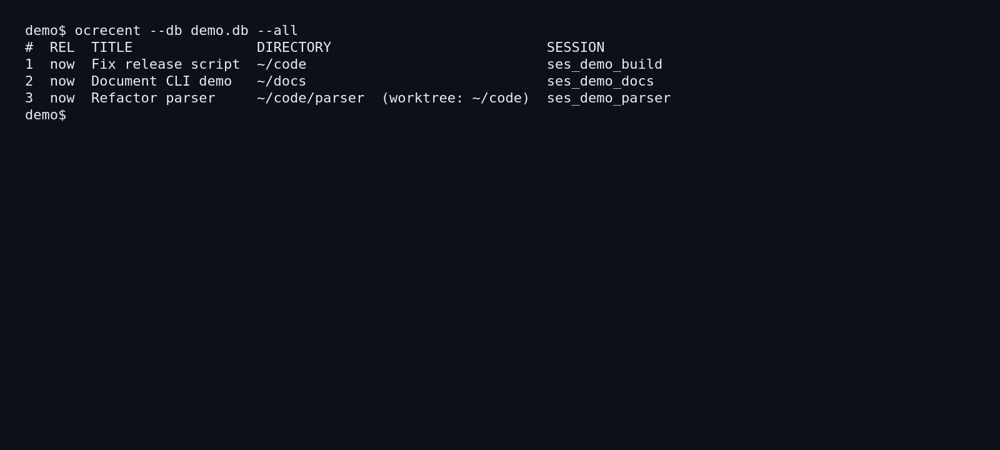

# ocrecent

Often forget the session name for your multiple opencode sessions? 

Worry no more.

`ocrecent` reads OpenCode's current SQLite store, finds root sessions across
projects, ranks them by `time_updated`, and opens the selected session in the
correct directory. It is a single Linux binary. It does not run as a daemon,
read transcripts, or mutate OpenCode state.

## Install

Arch Linux packaging is provided:

```sh
git clone https://github.com/ZanzyTHEbar/ocrecent.git
cd ocrecent/packaging
makepkg -si
```

Build directly with Go:

```sh
CGO_ENABLED=0 go build -trimpath -ldflags "-s -w -X main.version=dev" ./cmd/ocrecent
```

Optional runtime programs are used only when their feature is requested:

- Picker: `fuzzel`, `wofi`, `rofi`, `tofi`, `bemenu`, `dmenu`, or `fzf`
- Notifications: `notify-send` from `libnotify`
- Resume terminal: `foot`, `kitty`, `alacritty`, `ghostty`, or `wezterm`
- OpenCode: `opencode`

## Usage

```sh
ocrecent                         # list recent sessions
ocrecent --launch                # pick and launch a session
ocrecent list                    # recent sessions
ocrecent projects                # collapse sessions by project
ocrecent pick                    # list sessions or projects
ocrecent pick --launch           # pick and launch a session or project
ocrecent resume 1                # resume a ranked session by index
ocrecent resume ses_...          # resume by session ID
ocrecent last                    # list the newest session
ocrecent last --launch           # launch the newest session
ocrecent print ses_...           # print the resume command
ocrecent notify                  # show the notification actions
ocrecent doctor                  # diagnose data and desktop integration
ocrecent config set picker fzf   # persist a config value
```

## CLI Demo



Recorded locally from a fixed-size `tmux` PTY against the deterministic
`docs/assets/ocrecent-demo.sql` SQLite fixture and rendered with ImageMagick.
To reproduce the interaction, build `ocrecent`, seed the fixture, and run:

```sh
export HOME=/home/demo OPENCODE_DATA="$PWD/docs/assets"
sqlite3 demo.db < docs/assets/ocrecent-demo.sql
ocrecent --db demo.db --all
ocrecent --db demo.db --projects --all
ocrecent --db demo.db print 1
```

Common flags:

```text
-n, --max N       limit results (default: 8)
--all             disable the result limit
--children        include child and subagent sessions
--archived        include archived sessions
--json            emit a JSON array
--dir DIR         include DIR and descendants only
--picker NAME     choose a picker or use auto detection
--db PATH         add a database path; repeatable
--launch          launch instead of listing (root, pick, and last)
```

`resume` accepts a one-based index from the current filtered list or any
session ID in the filtered store and always launches it. The root command,
`pick`, and `last` list by default; add `--launch` to start a session. A TTY
replaces the current process with OpenCode. Without a TTY, `ocrecent` starts
the configured terminal.

## Configuration

The config file is `$XDG_CONFIG_HOME/ocrecent/config.toml`, or
`~/.config/ocrecent/config.toml` when `XDG_CONFIG_HOME` is unset:

```toml
n = 10
picker = "auto"
terminal = "kitty"
children = false
archived = false
notify_urgency = "normal"
```

Persist supported values with `ocrecent config set <key> <value>`. Supported
keys are `n`, `picker`, `terminal`, `children`, `archived`, and
`notify_urgency`.

Environment overrides:

```text
OPENCODE_DATA       OpenCode data directory
OCRECENT_N          result limit
OCRECENT_PICKER     picker
OCRECENT_TERMINAL   terminal
```

Database discovery checks `$OPENCODE_DATA/opencode.db`, `opencode db path`,
the XDG default, sibling `opencode-*.db` files, and paths passed with
`--db`. Databases are opened read-only.

## Desktop Integration

Install user units and an XDG autostart entry with:

```sh
ocrecent install
```

The command writes files under `~/.config` but does not enable systemd units.
For the user timer, import the graphical environment before enabling it:

```sh
systemctl --user import-environment WAYLAND_DISPLAY DISPLAY
systemctl --user daemon-reload
systemctl --user enable --now ocrecent-notify.timer
```

Wayland compositors can run `ocrecent notify` from their startup config.

## Development

```sh
go test ./...
go vet ./...
go build ./...
```

Pushes to `main` using Conventional Commits are released automatically. Each
release includes a changelog, Linux `amd64` and `arm64` archives, and SHA-256
checksums on GitHub. Release preparation also refreshes `packaging/PKGBUILD`
with the package version, pinned source commit, and source checksum.

The store tests use SQLite fixtures and do not require a live OpenCode
process. Exit codes are `0` for success, `1` for usage or not-found, `2` for
an unreadable store, and `130` when the picker is cancelled.
